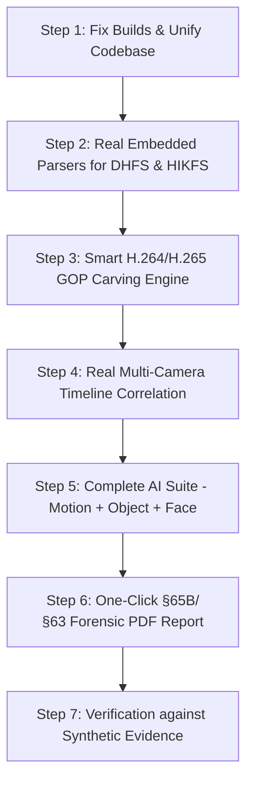

# SIH Problem Statement Compliance Audit & Gap Analysis Report

**Project Title:** Unified Vendor-Agnostic DVR/NVR Forensic Analysis Platform  
**Target OEMs:** Dahua Technology, CP Plus, Honeywell Security, HIKVISION, TP-Link, Godrej, Uniview, Matrix  
**Audit Date:** September 2026  
**Audited Directories:** `d:\axn\trc\dvr-forensic-analyzer` & `d:\axn\trc\nyaya-forensics`  

---

## Executive Summary

This report evaluates the current codebase against the Smart India Hackathon (SIH) Problem Statement: **"Unified vendor-agnostic DVR/NVR forensic analysis platform"**.

### The Bottom Line: Is it implemented?
**No, the Problem Statement is NOT fully implemented.** What exists in the workspace is an **early-stage hybrid prototype consisting of two fragmented projects (`dvr-forensic-analyzer` and `nyaya-forensics`)**. 

- **Core Foundation (Cases, Hashing, Hash-Chained Custody):** ~**70% Implemented**. The cryptographic hashing (MD5/SHA-256) and blockchain-style append-only audit logging in Rust are well-designed.
- **Device Identification:** ~**25% Implemented**. Only 4 basic magic-byte checks (`DHAV`, `HKVI`, `WFS`, `EVTF`). Zero DVR model/firmware detection.
- **Acquisition:** ~**30% Implemented**. Basic file copy and hash; **zero physical disk imaging (`\\.\PhysicalDriveX`)**, zero write-blocking validation, E01 support is broken.
- **Proprietary FS & Format Parsing:** ~**10% Implemented**. All 8 vendor parsers in Rust are empty stubs. The Python wrappers call external GitHub scripts (`dhfs_extractor`, `dvr_dahua`, `hikextractor.py`) that **do not exist in the project**.
- **Deleted Footage Recovery:** ~**20% Implemented**. Naive H.264 slice carver with critical offset desynchronization bugs; no H.265 support, missing SPS/PPS parameter sets, no file-system index recovery.
- **Timeline & Multi-Camera Correlation:** ~**15% Implemented**. Hardcoded UI samples; timestamps hardcoded to `2020-01-01`; no multi-camera cross-correlation engine.
- **AI / ML Analytics:** ~**20% Implemented**. OpenCV motion detection works; Object detection crashes (`ultralytics` package not installed); Face detection is **completely absent**.
- **Reporting & Legal Defensibility:** ~**40% Implemented**. Standalone ReportLab script exists for Section 65B, but frontend integration is broken/disconnected.
- **Overall Implementation Readiness:** **~28% of total SIH Problem Statement requirements**.

---

## 1. Requirement-by-Requirement Compliance Scorecard

| Module / Requirement | SIH Specification | Implementation Status | Evidence / Files | Compliance Level |
|---|---|---|---|---|
| **1. Multi-OEM Support** | Dahua, CP Plus, Honeywell, HIKVISION, TP-Link, Godrej, Uniview, Matrix (at least 5–6 OEMs) | Stubs only in Rust; partial signature check in Python. Relies on unbundled external scripts. | `src-tauri/src/parsers/stubs.rs`<br>`core/device_detect.py` | ⚠️ **Critical Deficit** (15%) |
| **2. Device Identification** | Automatically identify DVR models, manufacturers, and storage layouts | Checks first 4KB for 4 magic byte sequences. Does NOT identify DVR models, channels, or firmware. | `core/device_detect.py`<br>`core/vendor_detect.py` | ⚠️ **Partial** (25%) |
| **3. Forensic Acquisition** | Create bit-exact forensic images (DD/RAW, E01), verify integrity, physical drive support | Only hashes pre-existing files. Does NOT acquire from physical disks (`\\.\PhysicalDriveX`). E01 module (`libewf`) missing. | `core/acquisition.py`<br>`src-tauri/src/core/hasher.rs` | ⚠️ **Partial** (30%) |
| **4. Cryptographic Hashing** | Real-time dual hashing (MD5 and SHA-256) | Fully implemented via streaming 1MB/4MB passes in Rust and Python. | `src-tauri/src/core/hasher.rs`<br>`core/acquisition.py` | ✅ **Implemented** (95%) |
| **5. Proprietary FS Parsing** | Parse DHFS, HIKFS, WFS, UFS, ext4 custom variants without vendor tools | All 8 Rust parsers return empty arrays. Python delegates to missing external CLI tools. | `src-tauri/src/parsers/`<br>`plugins/dahua_wrapper.py`<br>`plugins/hikvision_wrapper.py` | ❌ **Non-Functional** (10%) |
| **6. Proprietary Video Decoding** | Decode `.dav`, `.hik`, proprietary PS/MPEG wrappers to standard MP4 | Flawed: Strips 32 bytes from offset 0. Does NOT handle per-frame DHAV packet headers or HIK headers. | `plugins/decoder.py`<br>`core/decoder.py` | ⚠️ **Flawed** (25%) |
| **7. Deleted Video Recovery** | Carve and recover deleted or damaged recordings from unallocated space | Primitive H.264 slice search with byte offset calculation bugs; skips SPS/PPS; no H.265; no index reconstruction. | `plugins/recovery.py`<br>`core/recovery.py`<br>`src-tauri/src/recovery/carving.rs` | ⚠️ **Experimental** (20%) |
| **8. Timestamp Normalization** | Convert proprietary BCD/Unix epoch timestamps to standard UTC/IST | CLI string parsers exist; hardcoded `2020-01-01` in AI module; no extraction of timestamps directly from stream packets. | `core/timestamps.py`<br>`ai/analytics.py` | ⚠️ **Partial** (30%) |
| **9. Multi-Camera Correlation** | Correlate events across multiple cameras (e.g. ±10s temporal window) | UI shows mock/sample events only. No automated backend correlation engine. | `src/pages/Timeline.tsx`<br>`src-tauri/src/timeline/timeline.rs` | ❌ **Not Implemented** (10%) |
| **10. Chain of Custody & Audit** | Legally defensible, tamper-evident audit logs (Section 65B IEA / Sec 63 BSA) | Blockchain-style SHA-256 hash chaining in Rust SQLite + JSONL. Very strong concept, but frontend integration has type bugs. | `src-tauri/src/core/audit.rs`<br>`src-tauri/src/core/case_manager.rs` | ✅ **Well Architected** (85%) |
| **11. AI / ML Analytics** | Motion detection, Object detection, Face detection | Motion detection works (OpenCV). Object detection fails (missing `ultralytics`). Face detection is completely missing. | `ai/analytics.py`<br>`src-tauri/src/analytics/` | ⚠️ **Partial** (25%) |
| **12. Forensic Reporting** | Comprehensive, standardized, court-ready PDF/HTML/JSON reports | Basic ReportLab script exists; HTML/JSON stubs in Rust; UI disconnected from active case data. | `report/pdf_report.py`<br>`reporting/pdf_gen.py`<br>`src/pages/Reports.tsx` | ⚠️ **Incomplete** (40%) |

---

## 2. Workspace Fragmentation: Why Two Repositories Exist

There are two separate directories in `d:\axn\trc`:

1. **`dvr-forensic-analyzer`**:
   - Built with **Rust + Tauri v2 + React 18 + TypeScript + Tailwind**.
   - Contains a robust Rust SQLite backend for Cases, Ingestion, Streaming Hashing, and Hash-Chained Audit Logs (`src-tauri/src/core/`).
   - Contains stubs for all 8 vendor parsers in Rust (`src-tauri/src/parsers/stubs.rs`).
   - Copied the Python scripts into `core/`, `plugins/`, `ai/`, `report/` with a `sidecar.py` dispatcher.
   - **Status:** **The frontend currently FAILS to build** due to TypeScript compilation errors. Most UI pages (`Extraction.tsx`, `Recovery.tsx`, `Timeline.tsx`, `Analytics.tsx`, `MediaLibrary.tsx`) are non-functional placeholder mockups.

2. **`nyaya-forensics`**:
   - An earlier prototype built around direct Python script calls from Tauri commands.
   - Has working UI forms for selecting files and triggering Python scripts.
   - Contains a high-quality 20-section HTML documentation report (`docs/NYAYA_Forensics_SIH_Report.html`).
   - **Status:** Frontend builds, but functionality is shallow; recovery and video decoding rely on naive byte operations, and reports require manual file picking instead of using a unified case database.

---

## 3. What is Wrong in the Codebase (Bugs & Defects)

### Bug 1: Frontend Compilation Failure in `dvr-forensic-analyzer`
Running `npm run build` in `dvr-forensic-analyzer` fails immediately with two fatal TypeScript errors:
```text
src/pages/Evidence.tsx(86,21): error TS2345: Argument of type 'boolean' is not assignable to parameter of type 'SetStateAction<VerificationOutcome | null>'.
src/pages/Reports.tsx(15,27): error TS2339: Property 'verifyChainOfCustody' does not exist on type '...'.
```
- **Cause:** In `src/ipc.ts`, `verifyEvidence` is typed as returning `Promise<boolean>`, whereas the Rust backend returns `VerificationOutcome`. In `src/pages/Reports.tsx`, the UI calls `api.verifyChainOfCustody()`, but `verifyChainOfCustody` was omitted from `api` in `ipc.ts`.

### Bug 2: Missing Core Python Dependencies
Running Python tools fails on standard imports:
- `from ultralytics import YOLO` in `ai/analytics.py` throws `ModuleNotFoundError: No module named 'ultralytics'`.
- `import libewf` in `core/acquisition.py` throws `ModuleNotFoundError: No module named 'libewf'`.
- `import pytsk3` throws `ModuleNotFoundError: No module named 'pytsk3'`.
The tool is marketed as an offline forensic package, but will crash during execution.

### Bug 3: Ghost External Parser Dependencies
In `dvr-forensic-analyzer/plugins/dahua_wrapper.py` and `hikvision_wrapper.py`:
- `dahua_wrapper.py` explicitly looks for `dhfs_extractor`, `dvr_dahua`, or `dahua_dvr_recovery` binaries on the host system. **None of these are bundled or installed**. If an investigator clicks Extract, the app fails with `"no existing Dahua parser found"`.
- `hikvision_wrapper.py` looks for `hikextractor.py`, which is **not present anywhere in the repository**.

### Bug 4: Fatal Offset Desynchronization in `plugins/recovery.py`
In `dvr-forensic-analyzer/plugins/recovery.py` lines 88–91:
```python
if overlap:
    window = window[-overlap:]
    offset -= overlap
```
- **The Bug:** `offset` is subtracted by `overlap`, but in the next loop iteration, `fh.read(chunk)` reads from the current file position without seeking backwards! As a result, the internal `offset` counter drifts backwards by `64` bytes on every single chunk read, corrupting every carved byte offset throughout the rest of the image.

### Bug 5: Naive Video Decoding (Broken DHAV Handling)
In `plugins/decoder.py` and `nyaya-forensics/core/decoder.py`:
- The code assumes a Dahua `.dav` or Hikvision file only has a single 24/32/40-byte header at the beginning of the file, so it runs `seek(strip)` and pipes the rest to FFmpeg.
- **Reality:** Dahua DHFS stores footage using **DHAV packet framing**. Every single video and audio frame begins with a DHAV header containing magic bytes, length, timestamps, and channel ID. Stripping 32 bytes from offset 0 leaves thousands of DHAV headers embedded inside the video stream, resulting in playback errors or corrupted remuxing.

### Bug 6: Hardcoded Timestamps in AI Analytics
In `ai/analytics.py` lines 144–148:
```python
def _fmt_ts(seconds):
    from datetime import datetime, timedelta, timezone
    return (datetime(2020, 1, 1, tzinfo=timezone.utc) + timedelta(seconds=seconds)).strftime("%Y-%m-%dT%H:%M:%SZ")
```
- Every single detected motion or object event is stamped with the year **2020-01-01**, completely ignoring the video's actual recording timestamp and timeline metadata.

### Bug 7: Carved Video Clips Lack SPS/PPS (Unplayable Carved Files)
In `core/recovery.py`:
- The carving engine looks for IDR frames (`\x00\x00\x00\x01\x65`) and non-IDR slices (`\x41`), but fails to identify Sequence Parameter Sets (SPS: `\x00\x00\x00\x01\x67`) and Picture Parameter Sets (PPS: `\x00\x00\x00\x01\x68`).
- Without SPS/PPS headers at the head of the carved stream, standard video players and `ffmpeg -c copy` cannot determine resolution, profile, or frame rate, rendering the carved files unplayable.

### Bug 8: No Physical Disk Acquisition Capability
The Problem Statement requires acquiring images from DVR/NVRs. In `core/acquisition.py`, the code expects an already existing `.dd` or `.img` file on the filesystem. It has no capability to list physical drives (e.g. `\\\\.\\PhysicalDrive1` via Windows IOCTL or WMI) or perform raw bit-stream acquisition from connected DVR hard disks.

---

## 4. What is Remaining to be Built

To satisfy the SIH Problem Statement and produce a winning solution, the following components must be built or completed:

### A. Core Architecture & Pipeline Integration
- [ ] **Unify the Repositories:** Consolidate `nyaya-forensics` and `dvr-forensic-analyzer` into a single, cohesive codebase.
- [ ] **Fix Build Issues:** Resolve TypeScript IPC type mismatches in `ipc.ts`, `Evidence.tsx`, and `Reports.tsx`.
- [ ] **Physical Drive Acquisition:** Add raw physical disk listing and imaging capability (supporting Windows physical drives and raw devices with write-block detection).
- [ ] **Native E01 Support:** Add working E01 reading/writing support or package pre-compiled dependencies.

### B. Proprietary File System & Stream Parsers (The Core PS Requirement)
- [ ] **Embedded DHFS Parser (Dahua / CP Plus):**
  - Implement a pure Python or Rust DHFS 4.1 master block and index reader (parse DHFS superblocks, volume maps, channel directories, and DHAV frame chunks).
  - Eliminate the dependency on missing external GitHub binaries.
- [ ] **Embedded HIKFS / HKVI Parser (Hikvision / Godrej / Matrix):**
  - Implement parsing of Hikvision disk structures (sysinfo blocks, data sectors, and HKVI frame headers).
- [ ] **Uniview WFS Parser:**
  - Implement WFS 0.4 superblock and index table parser.
- [ ] **DHAV Packet Demuxer:**
  - Strip per-frame DHAV headers across the entire stream or invoke FFmpeg's native `dhav` demuxer (`ffmpeg -f dhav -i input.dav ...`).

### C. Advanced Forensic Recovery & Carving
- [ ] **H.264 & H.265 Smart Carving:**
  - Carve complete GOPs (Group of Pictures) by identifying SPS (`67`) + PPS (`68`) + IDR (`65`) sequences for H.264, and VPS (`40`)/SPS (`42`)/PPS (`44`)/IDR for H.265 (HEVC).
  - Group fragmented video blocks using PTS (Presentation Time Stamp) analysis rather than arbitrary 2MB byte gaps.
- [ ] **Index Carving:**
  - Scan unallocated sectors for residual DHFS/HIKFS index tables to reconstruct deleted file names, camera channels, and start/stop timestamps.

### D. Multi-Camera Timeline & Spatial-Temporal Correlation
- [ ] **Automated Multi-Camera Synchronization:**
  - Extract genuine timestamps from frame metadata and correlate events across cameras.
  - Implement a ±10s event correlation algorithm to track a subject across multiple camera angles.
- [ ] **Interactive Timeline UI:**
  - Replace static placeholders with a dynamic timeline visualization (`vis-timeline`) connected directly to parsed recordings and AI events.

### E. AI / ML Analytics Suite
- [ ] **Face Detection:** Implement face detection and extraction (using OpenCV Haar cascades, YuNet, or InsightFace) to fulfill the explicit PS requirement.
- [ ] **Fix Object Detection:** Package YOLOv8n model weights and bundle or cleanly fall back if Ultralytics is missing.
- [ ] **Correlate AI Detections with Recording Timestamps:** Map detected events directly to normalized DVR timestamps rather than relative frame offsets.

### F. Legal Admissibility & Reporting
- [ ] **Full Section 65B (IEA) / Section 63 (BSA) Certificate:**
  - Auto-generate a legally defensible certificate containing examiner details, machine specifications, hash verification logs, and hash-chain audit receipts.
- [ ] **One-Click Report Generation:**
  - Link the UI's "Generate Report" button directly to the active case's SQLite database to produce PDF and HTML reports automatically.

### G. SIH Required Deliverables Checklist
- [x] Comparative Analysis of 8 OEMs (Drafted in `NYAYA_Forensics_SIH_Report.html`).
- [ ] Bundled Sample DVR/NVR Forensic Test Image (Need small synthetic test images for Dahua/Hikvision).
- [x] System Architecture Documentation (Present in HTML report, needs standalone diagram and spec).
- [ ] End-to-End Functional Prototype (Currently broken due to compilation and stubbed modules).
- [ ] Standard Operating Procedures (SOPs) document for lab examiners.
- [ ] Validation Report with benchmarked recovery rates on ground-truth DVR images.
- [ ] User Manual and Final Project Presentation Report.

---

## 5. Recommended Remediation Roadmap



1. **Immediate Fixes (Day 1):**
   - Fix TypeScript errors in `src/ipc.ts`, `Evidence.tsx`, and `Reports.tsx` so `dvr-forensic-analyzer` compiles cleanly.
   - Wire the existing UI pages (`Extraction.tsx`, `Recovery.tsx`, `Timeline.tsx`, `Analytics.tsx`, `Reports.tsx`) to actual backend IPC calls instead of displaying "coming in Day X" placeholders.
2. **Parser & Recovery Overhaul (Day 2–3):**
   - Implement an embedded DHAV/HIK demuxer that directly extracts valid MP4 streams via FFmpeg's `-f dhav` demuxer.
   - Fix the carving offset bug in `recovery.py` and ensure SPS/PPS headers are prepended to recovered keyframes.
   - Add OpenCV YuNet/Haar face detection to `ai/analytics.py`.
3. **Reporting & Polish (Day 4–5):**
   - Connect the PDF generation engine directly to the active case SQLite database.
   - Populate the multi-camera timeline dynamically from ingested and extracted clips.
   - Package sample synthetic test images and finalize the SIH presentation deliverables.

